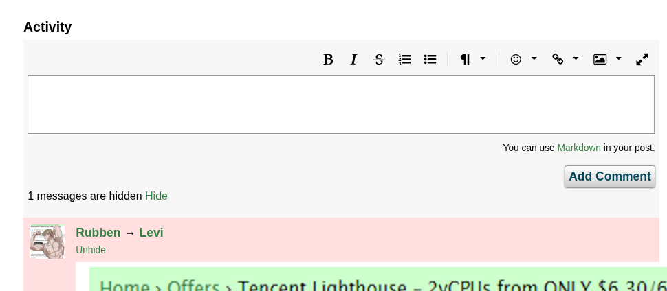

# LowEndMod

LowEndMod is a lightweight browser extension that adds various enhancements and usability tweaks to the [LowEndTalk](https://lowendtalk.com/) forum.

## Installation

Install the Firefox version from the [Firefox Addons Store](https://addons.mozilla.org/en-US/firefox/addon/lowendmod/)

## Features

- Hide posts, threads, or comments by specific users or keywords
- Hide signature sections in posts
- Seamless integration into the forum UI
- Customizable settings

## Screenshots

<details>
	<summary>View Screenshots</summary>
	<div>
		
	</div>
	<div>
		
	</div>	
	<div>
		
	</div>
</details>

## Building and contributing

Follow the steps below to set up the project locally:

1. **Clone the repository**

```sh
git clone https://github.com/yureitzk/lowendmod.git
cd lowendmod
```

2. **Install dependencies**

```sh
npm i
```

3. **Configure environment variables:**

Create a `.env` file in the project root and configure the following variables based on your needs:

- `FIREFOX`: Set to `1` to build the extension for Firefox, or `0` for other browsers (like Chrome).
- `MANIFEST_VERSION`: Set to `2` or `3` to specify the desired Manifest V2 or V3.

Example `.env` file:

```env
FIREFOX=0
MANIFEST_VERSION=3
```

4. **Build the extension**

```sh
npm run build
```

This will generate the build files in the `dist` directory.

If you'd like to contribute, feel free to open issues or submit pull requests.

## License

See [LICENSE](/LICENSE.txt).

